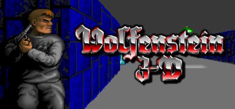
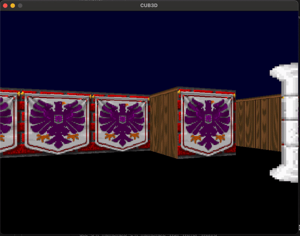

 

<h1><strong>CUB3D</strong></h1>

<h4><i>A network 42 project inspired by the world-famous game Wolfenstein3D. With as goal of the project a exploring raycasting and working with a very basic graphics library. </i></h4>

 

<h2>How to compile and run the program</h2>

1. Clone this git repository  
<code>git clone https://github.com/salbregh/CUB3D.git </code>

2. Go into the root of the directory  
<code>cd CUB3D</code>

3. Run the make command, which will compile the source code  
<code>make</code>

4. To execute the program you need type in the executable name followed by a .cub file, this file consists a map.  
<code>./cub3D map.cub</code>

<h2>The program</h2>

The program will open in a new window. Here you will be able to walk around in the map. 

Use the left and right arrow to rotate the view of the player.

  

Use the WASD keys to move the player forwards, back, left and right.

<h2>Map Parsing</h2>
A big part of this program is to validate the map before parsing. The following rules must be applied:
<ul>
    <li> the map must be composed of only 7 possible characters: 0 for empty space, 1 for a wall, 2 for sprits (objects) and N S E or W for the player's start position </li>
    <li> the map must be surrounded by walls
    * except for the map content, each type of element can be seperated by one or more empty lines </li>
    <li> except for the map content which always has to be last, each type of element can be set in any order in the file </li>
    <li> Except for the map, each type of information from an element can be separatedby one or more space </li>
    <li> Each element (except the map) firsts information is the type identifier (com-posed by one or two character(s)), followed by all specific informations for eachobject in a strict order such as : <code>NO ./path_to_north_texture</code> </li>
</ul>
If a misconfiguration is encountered in the map, the program must return an error message.

<h2>Future goals for this project </h2>
As the project is now a very simplistic version of the game, I would like to add in more features to make it more like the actual wolfenstein3D. Think of adding a scooter, eneniem and opening doors.

<h2>Possible errors</h2>
You might get the following error  
<i>xcrun: error: invalid active developer path (/Library/Developer/CommandLineTools), missing xcrun at: /Library/Developer/CommandLineTools/usr/bin/xcrun</i>   
 
If this occurs, install the following:  
<code> xcode-select --install </code>
